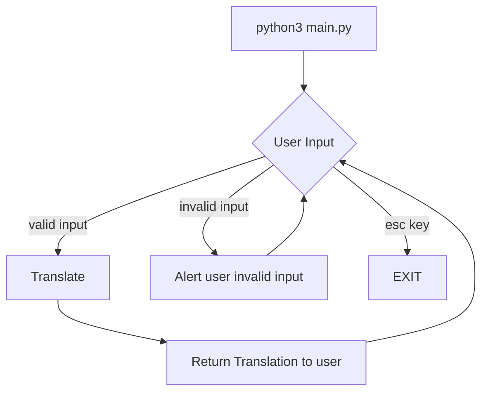

# Morse Code Generator - Rudi Lewis

## Project Description

Build and deploy a text-based (command line) Python program that takes any String input and converts it into [Morse Code](https://en.wikipedia.org/wiki/Morse_code).
Spend *no more than about __60 minutes__ of development time, use your time wisely to get the best features out!

## Mockup

> %python3 morse_code/main.py \
> Hello! Enter a phrase using English letters and/or numbers, and i'll convert it to Morse Code! \
> User Input (esc to quit): Hello. \
> Translation:  ....  .  .-..  .-..  ---  .-.-.- \
> User Input (esc to quit):

<!--  -->

<!-- to have more control over image size & appearance, markdown supports html img tags also:
  
-->

## To Run
<!-- 
### On The Web 
1. Project in its current state runs live on any device via standard browser at https://
-->
### In Your Local Environment
<!-- Python Project Local Environment Template-->
1. git clone this repo to a local project folder
2. consult `./requirements.txt` for necessary libraries to install (easily install those at the command line in your project folder with `pip install -r requirements.txt`)
3. consult `./.env.example` for clues on environment variables you'll need to provide in your own `.env` file using your own credentials (if required)
4. I built this project in __Python 3.14.2__, but I think it should work in any 3.8x or newer, based on the standard libraries and code used.

## Product Roadmap (Deliverables)

### MVP (Must Do)

- [x] translate A-Z and 0-9 into their [ITU Morse Code](./assets/International_Morse_Code.svg.png) equivalent
- [x] use the characters . for *dit* and - for *dah* and 2 spaces between letters (for easier visual interpretation, as in Mockup above), and 4 spaces between words and .-.-.- for period and ..--.. for question mark.
- [x] let the user hit esc (without enter) to quit
- [x] utilize object oriented programming wherever possible (classes and methods in separate external files, use class inheritance, keep main.py very tight and readable for flow.)
- [x] employ great documentation in any and all *.py files, written so other developers and casuals can easily understand your code blocks and flow

### Stretch Goals (Should Do at some point)

- [x] additional punctuation according to [Electronics-Notes.com](https://www.electronics-notes.com/images/morse-code-table-punctuation.svg)
- [ ] reverse translation (enter Morse, get back English)
  
### Super-Stretch Goals (Could Do at some point)

- [ ] make an audio output of the beeps to go along with the terminal output
  - [ ] a dit is a short beep (always followed by 1 silent dit), a dah is a long beep that should equal the length of 3 dits (plus 1 silent dit after it), a space (word break) is silence for 3 dits, and a sentence break is silence for 7 dits.
- [ ] "morse code math" according to notation in [Electronics-Notes.com](https://www.electronics-notes.com/images/morse-code-table-punctuation.svg)
- [ ] automatic "copy to clipboard" of the translated code

### Out of Scope (Won't Do)

- web interface / webapp UI (instructions were strictly to make it a terminal program, and spend ONLY about *60 minutes total* coding it!)

## Design

### Flowchart (Program Logic Flow)

## Development Workflow

- [x] 1. convert A-Z and 0-9 and period and question mark to a reference file ./assets/itu_morse.py
  - [x] 1. make sure it's easy to access individual elements in case we do reverse translation and need to compare to every letter. (dictionary? list?)
- [x] 2. write the user input block
- [x] 3. write the translation Class
- [x] 4. write the output to terminal block
- [x] 5. write the *esc to quit* clause/block
- [x] 6. END-TO-END TEST in as close to production environment as possible
- [x] 7. Create ./requirements.txt of necessary libraries
- [ ] 8. PRODUCTION DEPLOY (to pythonanywhere?)
  - [x] 1. pythonanywhere not really conducive to running terminal programs that aren't self-sufficient (users won't be able to get to your "running" program on a terminal. Best to have users download via the local route)

## Reflection
<!--
Write down how you approached the project. 
What was hard, what was easy? How might you improve for the next project? 
What was your biggest learning from today? 
What would you do differently if you were to tackle this project again?
-->

| DATE | COMMENTS |
| ----------- | -------- |
| 11-feb-2026 8pm | SUMMARY: did it all in 1 hour, very pleased with the simple but SHIPPED CODE!! But i'm not pleased how Gemini is reading & reacting to this README.md, had to give a lot of prompts (didn't write the translation table to assets, didn't bounce error for bad input, etc.) |
| 11-feb-2026 7pm | driving requirements through this README.md |

## References

- [Morse Code Wikipedia Page](https://en.wikipedia.org/wiki/Morse_code)

<!-- MORE EXAMPLES OF MERMAID DIAGRAMS
### Block Architecture Diagram (System Main Components)
architecture-beta
### Sequence Diagram (User Interaction)
sequenceDiagram
### Entity Relationships (Data Design)
erDiagram

can also do Gantt, Customer Journey/Friction, Pie, X/Y, Quadrant, Mindmap, many others.
see Mermaid live editor & docs [here](https://mermaid.live) for all possibilities 
-->