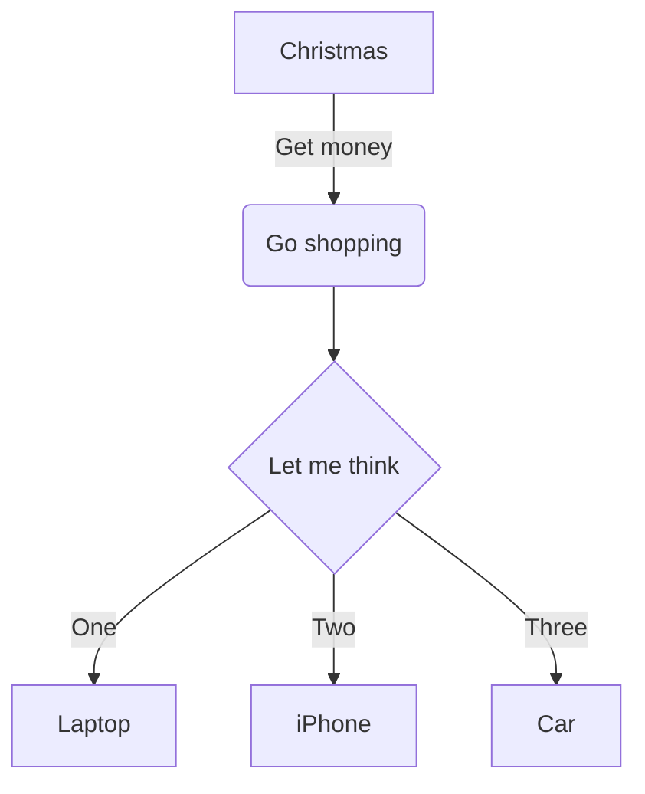

# Morse Code Generator - Rudi Lewis

## Project Description

A text-based (command line) Python program that takes any String input and converts it into [Morse Code](https://en.wikipedia.org/wiki/Morse_code).

## Mockup

<!-- to have more control over image size & appearance, markdown supports html img tags also:
  
-->

## To Run
<!-- 
### On The Web 
1. Project in its current state runs live on any device via standard browser at https://
-->
### In Your Local Environment
<!-- Python Project Local Environment Template-->
1. git clone this repo to a local project folder
2. consult `./requirements.txt` for necessary libraries to install (easily install those at the command line in your project folder with `pip install -r requirements.txt`)
3. consult `./.env.example` for clues on environment variables you'll need to provide in your own `.env` file using your own credentials (if required)
4. I built this project in __Python 3.14.2__, but I think it should work in any 3.8x or newer, based on the standard libraries and code used.

## Product Roadmap (Deliverables)

### MVP (Must Do)

- [ ] use the characters . for *dit* and - for *dah* and space for *word break* and .-.-.- for period and ..--.. for question mark.
- [ ] accurately convert A-Z and 0-9 to its corresponding code
- [x] utilize object oriented programming wherever possible (classes and methods in separate external files, use class inheritance, keep main.py very tight and readable for flow.)
- [x] employ great documentation in any and all *.py files, written so other developers and casuals can easily understand your code blocks and flow

### Stretch Goals (Should Do at some point)

- [ ] additional punctuation according to [Electronics-Notes.com](https://www.electronics-notes.com/images/morse-code-table-punctuation.svg)
  
### Super-Stretch Goals (Could Do at some point)

- [ ] make an audio output of the beeps to go along with the terminal output
  - [ ] a dit is a short beep, a dah is a long beep that should equal the length of 3 dits, a space is silence for 1 dit, and a sentence break is silence for 7 dits.
- [ ] morse code math according to [Electronics-Notes.com](https://www.electronics-notes.com/images/morse-code-table-punctuation.svg)

### Out of Scope (Won't Do)

- web interface / webapp UI (instructions were strictly to make it a terminal program)
- 

## Design

### Flowchart (Program Logic Flow)

## Development Workflow

- [ ] 1. convert A-Z and 0-9 to a reference list itu_morse.py
- [ ] 2. write the user input routine
- [ ] 3. write the conversion routine
- [ ] 4. write the output to terminal routine
  - [ ] 4.1 subtask
  - [ ] 4.2 subtask
  - [ ] 4.3 subtask
- [ ] 5. END-TO-END TEST in as close to production environment as possible
- [ ] 6. PRODUCTION BETA to fraction of actual users
- [ ] 7. FULL DEPLOYMENT ramp to 100% production

## Reflection
<!--
Write down how you approached the project. 
What was hard, what was easy? How might you improve for the next project? 
What was your biggest learning from today? 
What would you do differently if you were to tackle this project again?
-->

| DATE | COMMENTS |
| ----------- | -------- |
| 11-feb-2026 | SUMMARY: do this one last (you'll always put the most recent date at the top of the stack) |
| 11-feb-2026 11am | driving requirements through this README.md |

## References

- [README.md Best Practices](https://github.com/jehna/readme-best-practices) I follow (some, not a lot of) these best practices 😂
- [Markdown Guide - Basic Syntax](https://www.markdownguide.org/basic-syntax/)

<!-- MORE EXAMPLES OF MERMAID DIAGRAMS
### Block Architecture Diagram (System Main Components)
architecture-beta
### Sequence Diagram (User Interaction)
sequenceDiagram
### Entity Relationships (Data Design)
erDiagram

can also do Gantt, Customer Journey/Friction, Pie, X/Y, Quadrant, Mindmap, many others.
see Mermaid live editor & docs [here](https://mermaid.live) for all possibilities 
-->